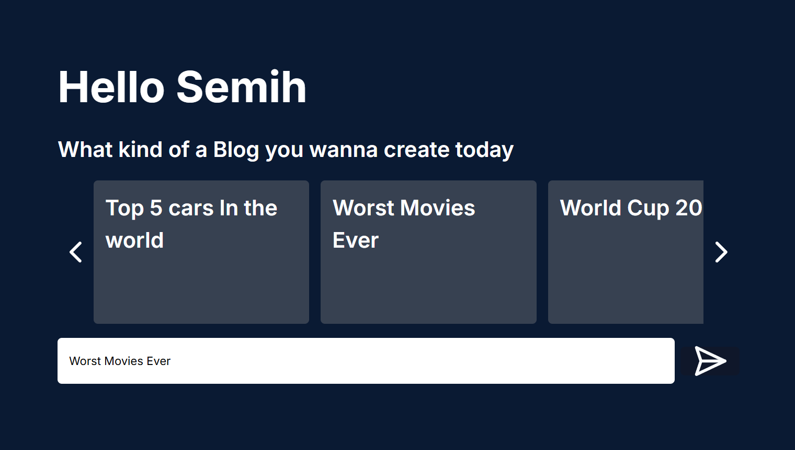
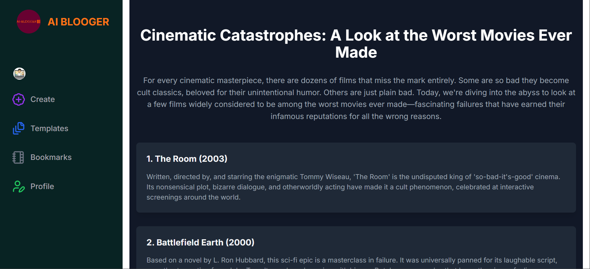
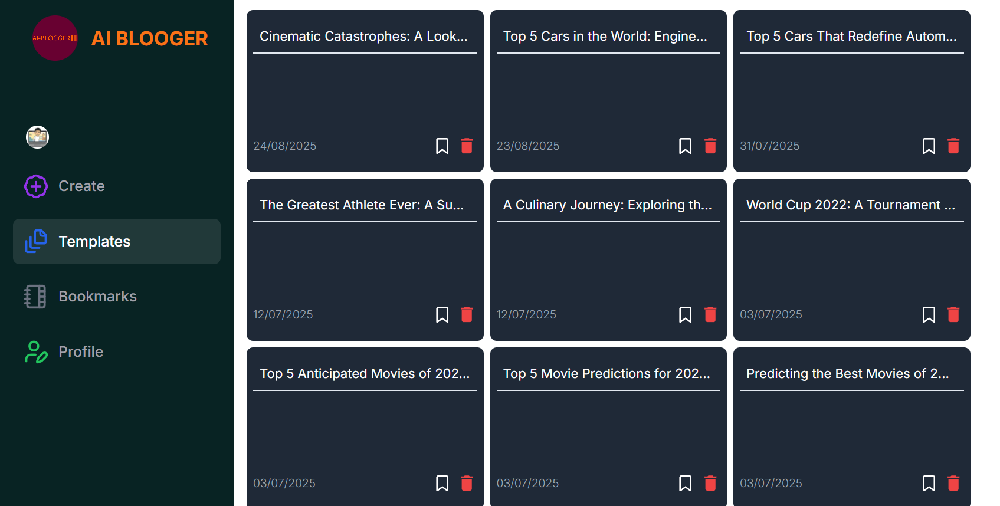

# AI Blogger 📝🤖  

AI Blogger is a modern web application that allows users to create full blog posts by simply entering a few words or prompts. Built with **Next.js** and **TypeScript**, AI-integration with **GEMINI**, powered by **Convex DB** for storing data, **Clerk** for authentication, and styled with **TailwindCSS**.  

---

## 🚀 Features  
- ✍️ **AI-powered blog generation** – turn a short prompt into a detailed blog post.  
- 🔐 **Secure authentication** with Clerk.  
- ⚡ **Real-time database** using Convex DB.  
- 🎨 **Responsive design** powered by TailwindCSS.  
- 🌐 **SEO-friendly** Next.js framework.  
- 🤖 **AI-INTEGRATİON** Gemini-2.5-flash

---

## 🛠️ Tech Stack  
- **Framework:** [Next.js](https://nextjs.org/) and [TypeScript](https://www.typescriptlang.org/) 
- **Database:** [Convex](https://convex.dev/)  
- **Authentication:** [Clerk](https://clerk.com/)  
- **Styling:** [TailwindCSS](https://tailwindcss.com/)  
- **AI:** [GEMINI](https://gemini.google.com/)

---

## 📦 Installation  

Clone the repository and install dependencies:  

```bash
git clone https://github.com/your-username/ai-blogger.git
cd ai-blogger
npm install
```
Set up environment variables in a .env file:

```bash
NEXT_PUBLIC_CLERK_PUBLISHABLE_KEY=
CLERK_SECRET_KEY=
NEXT_PUBLIC_CLERK_FRONTEND_API=

NEXT_PUBLIC_GOOGLE_API_KEY=

NEXT_PUBLIC_CONVEX_URL=
NEXT_PUBLIC_SIGN_IN_URL = /sign-in
NEXT_PUBLIC_SIGN_UP_URL = /sign-up
NEXT_PUBLIC_CLERK_AFTER_SIGN_UP_URL = /sign-in
NEXT_PUBLIC_CLERK_AFTER_SIGN_IN_URL = /create

```

## 🚀 After Signing In  

Once logged in, you’ll be redirected to the **Create Page**, where you can generate a new blog post.  

  

After your blog post is created, you’ll be taken to the **Blog Page** to view it in full.  

  

On this site, you have access to both your **blog content** and the **generated code**.  

  

You can also view all the templates you’ve created in the **Templates Page** for easy access and management.  


## 🤝 Contributing

Contributions are welcome! Please fork the repo and submit a pull request.